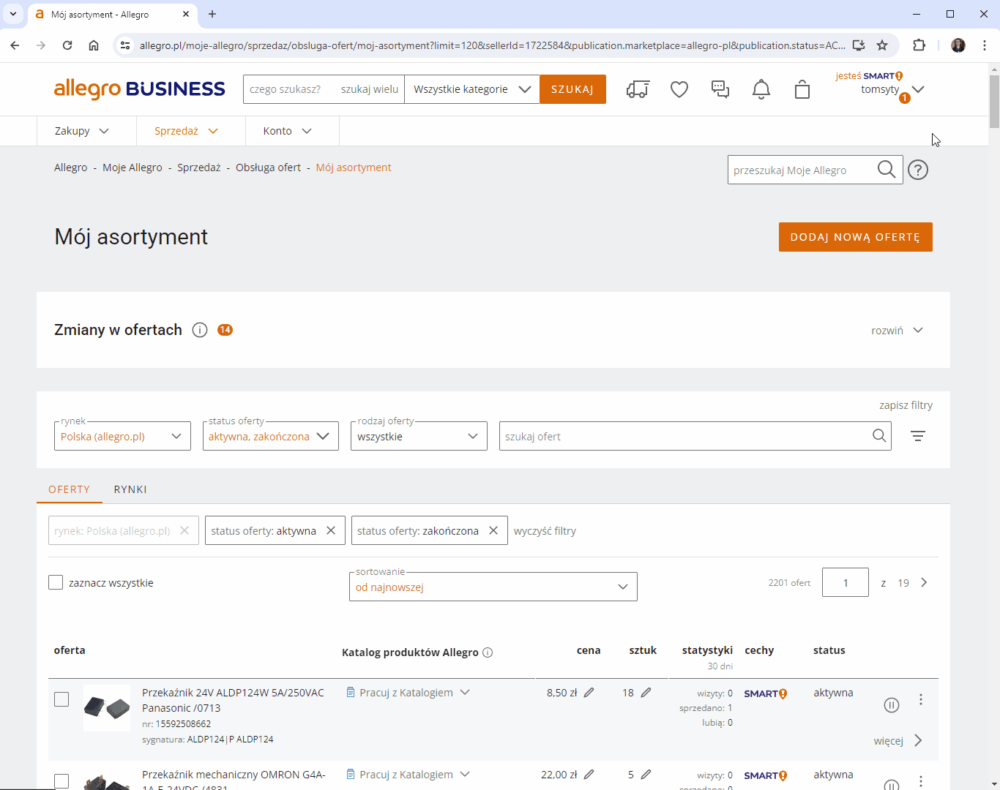
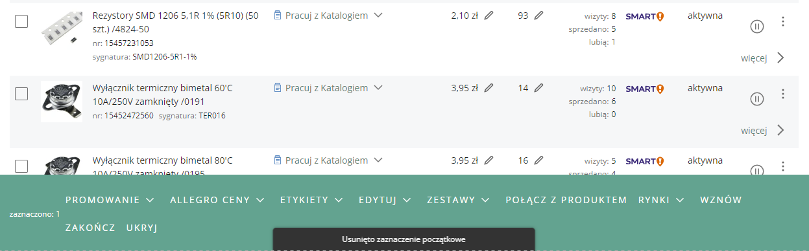

## Zaznaczanie ofert z klawiszem Shift
To rozszerzenie pozwala na zaznaczanie wielu ofert na stronie "Mój asortyment" z użyciem klawisza Shift podobnie jak ma to miejsce w przypadku plików w eksploratorze Windows. Niestety ze względów technicznych (metody tworzenia tabeli z listą ofert na stronie Allegro) zaznaczenie możliwe jest tylko dla ofert widocznych w danym momencie na ekranie (i kilku widocznych po przewinięciu listy). Można jednak korzystać z zaznaczenia wielokrotnie gdyż wcześniej zaznaczone elementy nie są odznaczane, stąd też brak potrzeby implementacji funkcji klawisza Ctrl jak w przypadku plików w eksploratorze Windows. Zaznaczenie pozwala również na deselekcję ofert, czyli można np. zaznaczyć wszsytkie i odznaczyć wybrany zakres (zakresy).

Jest to rozszerzenie do przeglądarki Chrome. Wszystkie rozszerzenia testuję tylko dla systemu Windows 10 i najnowszej wersji przeglądarki.

**Instrukcja instalacji:**
1. Pobierz rozszerzenie "select_offers.zip" z listy plików widocznej powyżej i rozpakuj je tam gdzie zamierzasz je trzymać.
2. Kliknij ikonę menu rozszerzeń w prawym górnym rogu okna przeglądarki (ikona puzzla)  lub z menu przeglądarki wybierz "Rozszerzenia - Zarządzaj rozszerzeniami".
3. Włącz "Tryb dewelopera" w prawym górnym rogu okna przeglądarki 
4. Kliknij przycisk "Załaduj rozpakowane"  

5. Wybierz folder z uprzednio pobranym i rozpakowanym rozszerzeniem.

To wszystko. Jeżeli miałeś otwartą stronę "Mój asortyment", odśwież ją celem załadowania rozszerzenia. Po kliknięciu pierwszego checkboxa jest on zapamiętywany jako początkowy. Po kliknięciu innego, wszystkie pomiędzy nim a początkowym zostaną zaznaczone (lub odznaczone). Jeżeli przewiniesz listę ofert zbyt daleko, pojawi się komunikat "Usunięto zaznaczenie początkowe":

nie zaznaczysz wtedy ofert z klawiszem Shift. Spowodowane jest to tym, iż Allegro korzysta z tzw. Intersections Observer API, które ładuje oferty na stronę w momencie przewijania listy (i kilka z wyprzedzeniem żeby zachować płynność pojawiania się ofert na ekranie). Oferty które przestają być widoczne na ekranie po przewinięciu są jednak usuwane z tabeli, dlatego też tak naprawdę w danym momencie w tabeli jest tylko kilkanaście ofert (w zależności od rozdzielczości ekranu mniej lub więcej) niezależnie od wybranej opcji pokazywania liczby ofert na stronie.

Rozszerzenie możesz sprawdzić w serwisie testowym [Allegro Sandbox](https://developer.allegro.pl/tutorials/informacje-podstawowe-b21569boAI1#srodowisko-testowe).  

***
Jeżeli napotkasz jakieś błędy w trakcie działania aplikacji, masz jakieś pytania, sugestie, problemy z obsługą, daj znać w sekcji "Discussions".
Jeżeli podoba Ci się moja praca i chcesz aby była dalej rozwijana, możesz wesprzeć mnie dotacją na dowolną kwotę przez PayPal (nie ma potrzeby posiadania konta PayPal): [przekaż donację](https://www.paypal.com/donate/?hosted_button_id=GVU3UC2ZY85SN&locale.x=pl_PL)
